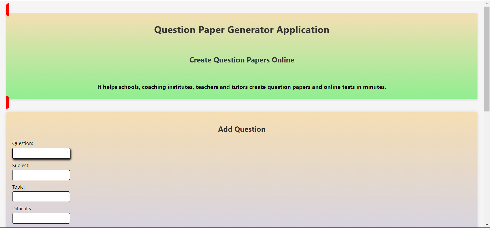

# Question Generator Application

The application store a number of questions in a Question Store. A question can have the following attributes {question, subject, topic, difficulty, marks}

The Question paper Generator look for questions in the Question Store and then generate the question paper based on the total marks and the distribution of marks based on Difficulty.

**Example**

Assume the below requirement for a question paper:

> (100 marks, Difficulty, {20% Easy, 50% Medium, 30% Hard })
